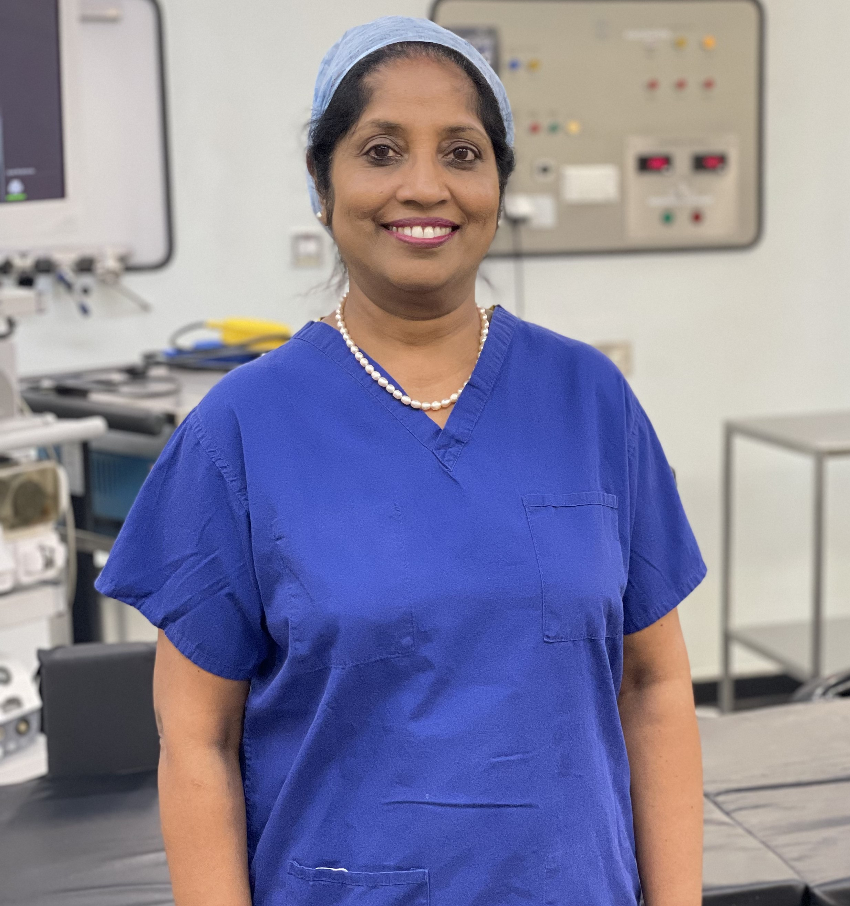
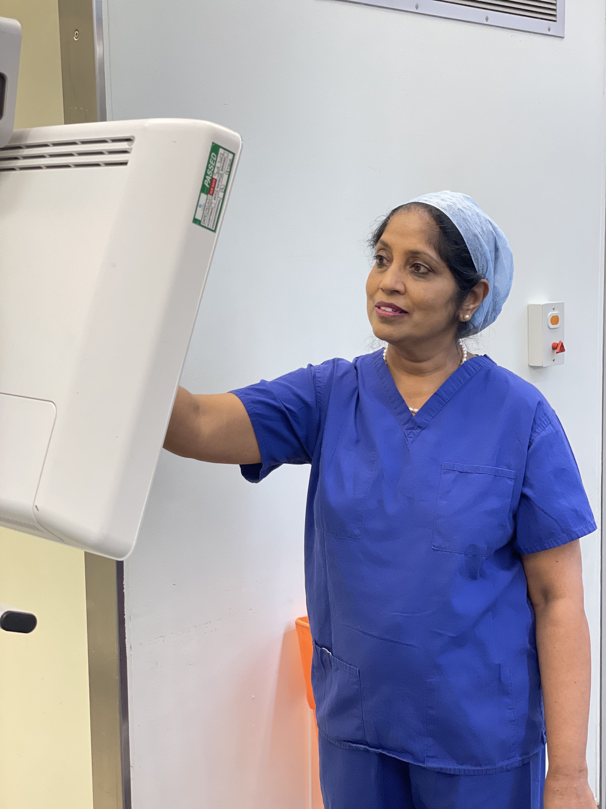

<figure markdown>
  { width="400" height="400" align=center }
  <figcaption>Miss Devanna Rajeswari MBBS MRCPI FRCOG</figcaption>
</figure>

Miss Rajeswari has over 30 years of experience in the field of Gynaecology. Having trained in India, Kenya and the Republic of Ireland, Miss Rajeswari brings a wealth of experience and knowledge to treat patients.

After completing her higher training in North West London, Miss Rajeswari was appointed Consultant Obstetrician and Gynaecologist in 2008.

<figure markdown>
  { width="400" height="400" align=center }
</figure>

Miss Rajeswari has since been awarded the ‘Ashford and St. Peter’s Clinical Excellence Award’ twice for her outstanding patient care.

During this period, Miss Rajeswari also played an active role in educating trainees and students. Miss Rajeswari was selected to author a chapter in the Oxford Handbook of Obstetrics and Gynaecology.
