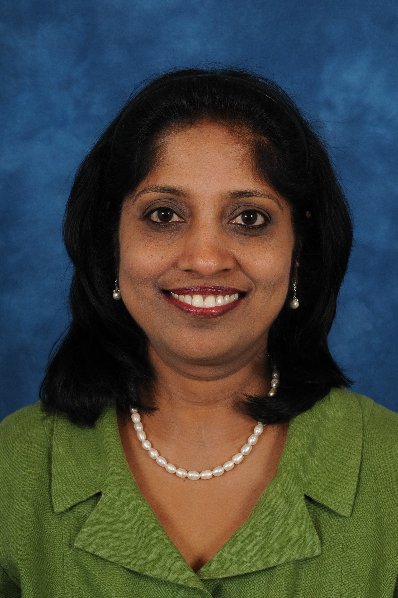

<figure markdown>
  { width="400" align=center }
  <figcaption>Miss Devanna Rajeswari MBBS MRCPI FRCOG</figcaption>
</figure>

With training in India, Kenya, and the Republic of Ireland, Miss Rajeswari brings a wealth of international experience to her role as a Consultant Obstetrician and Gynaecologist at St. Peter's Hospital. Following her higher training in North West London, she was appointed to her current position in 2008, where she has gained a reputation for outstanding patient care.

Miss Rajeswari has been awarded multiple Clinical Excellence Awards for her exceptional work. 

## #TODO - ADD BOOK CHAPTER, TO BE PROVIDED
She has also contributed to the medical community by writing a chapter in a book on the topic of obstetrics and gynaecology.
